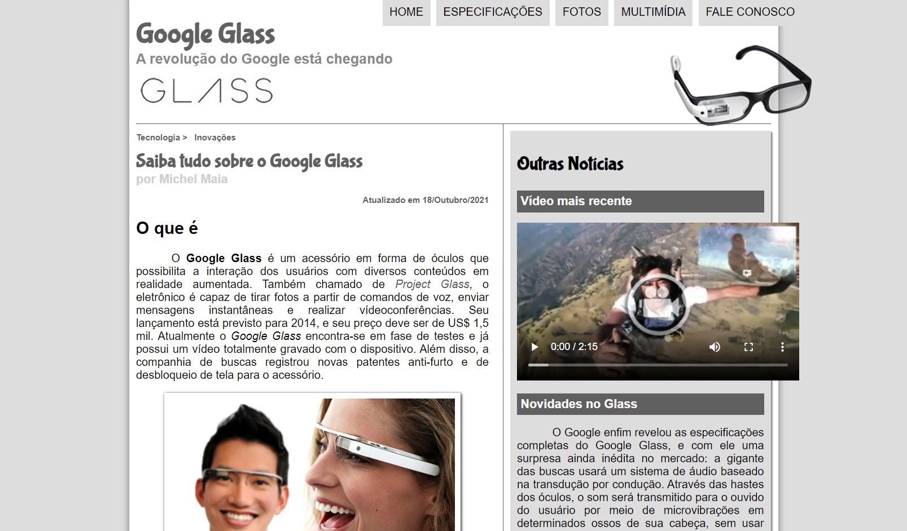

# Projeto Google Glass 

> Plataforma Curso em Vídeo

 Este é meu primeiro projeto e foi desenvolvido em aula durante o curso de HTML5 - Curso em Video.

 19/10/2021 - Michel Maia

[ 📎 Clique aqui para acessar] (https://michel-maia.github.io/Projeto-PG-Google-Glass/)

 ## Tecnologias 🖥️ 🚀 

- HTML
- CSS
- JavaScript
- Git e GitHub

